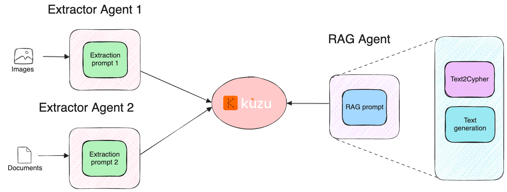

# Graph extraction and Graph RAG with BAML and Kuzu

This repository contains a demonstration of transforming unstructured data from clinical notes
and drug side effects in to a knowledge graph. The graph is then used to answer questions
about the data using a Graph RAG pipeline.

Tools used
- BAML: AI and LLM prompting framework
- Kuzu: Embedded, fast, scalable graph database
- Streamlit: Visualization framework for building custom web apps

## Overview

The goal is to show how to build modular "agents" (i.e., prompt pipelines that accomplish a
subtask) that can then be strung together to accomplish more complex tasks. BAML allows users
to compose together these kinds of agents with testing and validation capabilities, by offering
a reliable means to generate structured outputs from LLMs.

Kuzu is used as a data store for the graph, and Streamlit is used to build a simple UI for
interacting with the graph.

The general components of the pipeline are shown in the diagram below.



## Requirements

- Python 3.11+
- [Kuzu](https://github.com/kuzudb/kuzu) graph database
- [BAML](https://github.com/boundaryml/baml) AI and LLM prompting framework
- [Streamlit](https://github.com/streamlit/streamlit) visualization framework

## Installation

1. Clone this repository
2. Install the required dependencies:
   ```bash
   # Install the uv package manager
   curl -fsSL https://get.uvm.dev | bash
   # Install the dependencies
   uv sync
   ```

## Extract data from images and text

To extract data from images and text, run the following command:

```bash
cd src
# Extract data from images that represent tables from the PDF of drugs and side effects
python image_extractor.py
# Extract data from the text of clinical notes
python notes_extractor.py
```

This will output JSON files into the `./data/extracted_data` directory.

## Creating the graph

To create the graph, run the following command:

```bash
cd src
python 01_create_drug_graph.py
```

This will create the graph in the `./ex_kuzu_db` directory.

To add the patient data to the graph, run the following command:

```bash
cd src
python 02_create_patient_graph.py
```
This will augment the pre-existing graph (from the prior step) with the data from the
patient notes.

## Running the Graph RAG chatbot

To run the Streamlit application:

```bash
cd src
streamlit run streamlit_app.py
```

The application will be available at http://localhost:8501 by default.

## Sample questions

The application comes with several sample questions you can try:
- "What side effects did patient X7F3Q experience?"
- "What drug brands are there for lansoprazole?"
- "What are the side effects of morphine?"

## How it works

1. The user enters a question in natural language
2. BAML converts the question to a Cypher query
3. The Cypher query is executed against the Kuzu graph database
4. The results are processed and a natural language answer is generated
5. Both the query and answer are displayed to the user

## Notes

- The application maintains a history of up to 10 recent questions and answers
- You can clear the history using the "Clear History" button
- A debug mode is available in the sidebar that provides:
  - The GraphRAG schema used for generating Cypher queries
  - Detailed information about the latest result
  - A direct Cypher query execution interface for testing


> [!NOTE]
> The Graph RAG application is far from perfect and has room for improvement. For example,
> custom modules can be incorporated downstream of Text2Cypher to check the Cypher queries
> for syntax errors before execution. In addition, corrector agents could be added to the
> pipeline to increase robustness so that fewer questions result in an empty response.