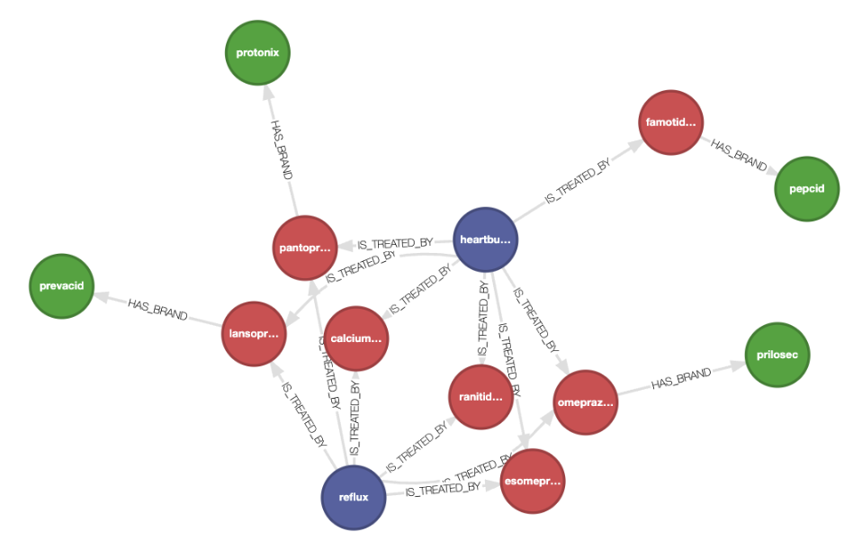
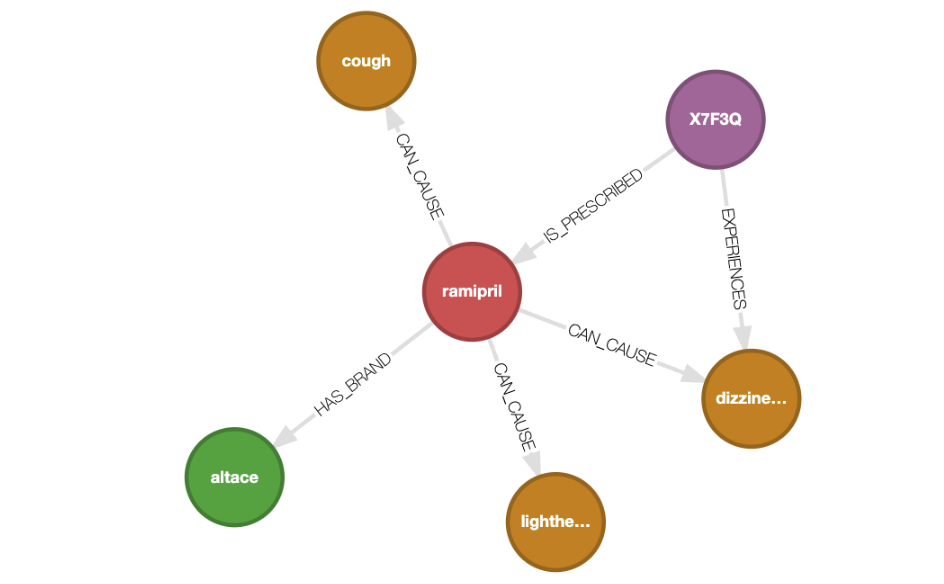

# Graph visualization

## Visualization

Graph visualization is a great method to understand the structure and the "connectedness" of your data.
You can visualize graphs in Kuzu using its browser-based UI,
[Kuzu Explorer](https://docs.kuzudb.com/visualization/). Docker is required to run Kuzu Explorer.
You can run the latest version of Kuzu Explorer by pulling the image from DockerHub provided using
the provided `docker-compose.yml` file.

Run the following commands in the directory where the `docker-compose.yml` is:

```bash
docker compose up
```

Alternatively, you can type in the following command in your terminal:

```bash
docker run -p 8000:8000 \
           -v ./ex_kuzu_db:/database
           -e MODE=READ_WRITE \
           --rm kuzudb/explorer:latest
```

This will download and run the Kuzu Explorer image, and you can access the UI at `http://localhost:8000`.

Enter the following Cypher query in the shell editor to visualize the graph:

```cypher
MATCH (a)-[b]->(c)
RETURN *
LIMIT 50
```



Enter other queries such as the following to interactively explore the
graph further by double-clicking the nodes!

```cypher
MATCH (p:Patient {patient_id: "X7F3Q"})-[r*1..4]->(x)
RETURN *;
```



Run the Streamlit app as per the [README](../README.md#running-the-graph-rag-chatbot) to interactively chat with the graph.